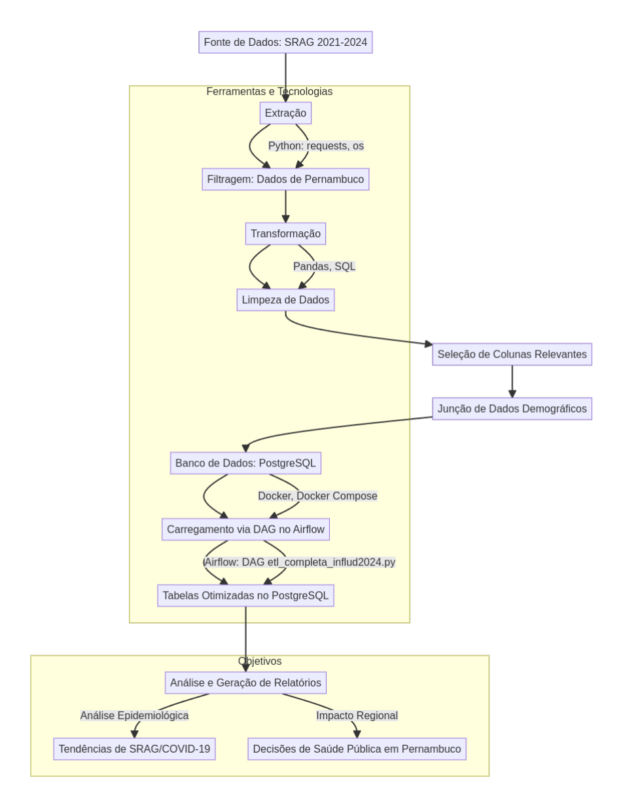

# 🚀 NGI Secoge Challenge

Este projeto foi criado como parte do desafio **NGI Secoge**. Ele envolve a construção de uma pipeline de dados utilizando Python e SQL. O objetivo é realizar a extração, transformação e carregamento de dados, além de gerar relatórios.

## ⚙️ Ferramentas Utilizadas

- 🐍 **Python** – Linguagem de programação para manipulação de dados e execução do pipeline.
- 📊 **Pandas** – Biblioteca para manipulação e análise de dados.
- 🌐 **Requests** – Biblioteca para realizar requisições HTTP.
- 🐘 **psycopg2** – Adaptador PostgreSQL para Python, utilizado para comunicação com o banco de dados.
- 🛠 **virtualenv** – Ferramenta para criar ambientes virtuais em Python.
- ⚡ **SQLAlchemy** – Biblioteca para trabalhar com bancos de dados SQL de forma mais eficiente.
- 🐋 **Docker** – Utilizado para rodar containers de ambiente e banco de dados.
- ✈️ **Airflow** – Plataforma para orquestração de workflows e automação de pipelines de dados.
- 🐘 **PostgreSQL (Docker)** – Banco de dados relacional utilizado no projeto.
- ⚡ **SQL** – Para consultas e manipulação dos dados.

## 📂 Estrutura de Diretórios

```bash
.
├── dags
│   ├── descricao_diretorio_dags.txt               # Descrição sobre as DAGs utilizadas
│   ├── direto_etl_dados_influd2024.py             # Script principal da DAG para o ETL
├── data
│   ├── descricao_diretorio_data.txt               # Informações sobre os dados armazenados
│   ├── Dicionario_de_Dados_SRAG_Hospitalizado...  # Dicionário de dados para referência
│   ├── Dicionário dos headers nescessários.txt    # Mapeamento dos headers essenciais
│   ├── Info_adicionais.txt                        # Informações adicionais sobre os dados
│   └── setup.sql                                  # Script SQL para inicializar o banco
├── db
│   ├── descricao_diretorio_data.txt               # Descrição sobre os arquivos de banco
│   ├── obitos_f_ou_m.py                           # Script Python para análise de óbitos
│   ├── obitos_f_ou_m.sql                          # Consulta SQL para análise de óbitos
│   ├── obitos_menos_12_vacinad.sql                # Consulta SQL sobre vacinação de menores
│   ├── obitos_vacina.sql                          # Consulta SQL sobre óbitos e vacinas
│   └── teste_conexao.py                           # Script para testar conexão com o banco
├── docker-compose.yml                             # Arquivo de configuração do Docker Compose
├── dockerfile                                     # Dockerfile para construção da imagem
├── help
│   ├── desafio técnico bgi secoge Eng de dados... # Documento detalhando o desafio técnico
│   ├── desafio técnico bgi secoge Eng de dados... # Versão em texto do desafio técnico
│   └── diagrama_projeto.png                       # Diagrama visual do projeto
├── README.md                                      # Arquivo README principal do projeto
├── RELATÓRIO.md                                   # Relatório do projeto
├── requirements.txt                               # Dependências do projeto
└── scripts
    ├── descricao_diretorio_scripts.txt            # Informações sobre os scripts
    ├── extracao.py                                # Script para extração de dados
    ├── main.py                                    # Script principal do projeto
    └── transformar_salvar.py                      # Script para transformar e salvar dados

6 directories, 26 files
```
🛠️ Observações:
- Cada diretório contém uma descrição detalhada para facilitar a navegação e entendimento.
- Utilize os scripts localizados na pasta `db` para realizar consultas e validações no banco de dados.



## 📥 Como Rodar o Projeto

### 1️⃣ Clone o repositório

Primeiro, faça o clone do repositório:

```bash
git clone https://github.com/DuxAlex/ngi_secoge_challenge
```

### 2️⃣ Verifique se o Docker está instalado

Certifique-se de que o Docker está instalado no seu computador. Para verificar, execute:

```
docker --version
```

Se não estiver instalado, siga a [a documentação do docker](https://docs.docker.com/engine/install/) para realizar a instalação.

### 3️⃣ Verifique se o Python está instalado

Verifique se o Python está instalado:

```
python --version
```

Se não estiver instalado, siga a [a documentação do python](https://www.python.org/downloads/) para realizar a instalação.

## Ambiente Virtual

## 4️⃣ Instale o `virtualenv`:

    ```bash
    pip install virtualenv
    ```

## 5️⃣ **Crie o ambiente virtual**:

    ```bash
    virtualenv .venv
    ou
    python3 -m venv .venv

    ```

## 6️⃣ **Ative o ambiente virtual**:

    - **No Linux**:
    
      ```bash
      source .venv/bin/activate
      ```
    
    - **No Windows**:
    
      ```bash
      venv\Scripts\activate
      ```

## 7️⃣ **Instale as dependências do projeto**:

    ```bash
    pip install -r requirements.txt
    ```

## 8️⃣ **Subindo o Docker Compose:**

Depois de executar os scripts, agora é necessário subir os contêineres usando o Docker Compose. 

na raiz do diretório digite:

```
se no linux:
sudo docker compose up -d

ou windows 
docker compose up -d

verifique a situação dos containers digitando
sudo docker ps


e também:

sudo docker logs ngi_secoge_postgres
e
sudo docker logs ngi_secoge_airflow
```

## Explicação dos Códigos

### 1️⃣ `docker-compose.yml`

O arquivo `docker-compose.yml` define dois serviços principais: **PostgreSQL** e **Airflow**, configurados para rodar em contêineres Docker. 

#### Serviços:

- **PostgreSQL**:
  
  - Utiliza a imagem `postgres:12`.
  - O contêiner é chamado `ngi_secoge_postgres`.
  - Variáveis de ambiente são configuradas para criar o banco de dados (`ngisecoge`), o usuário e a senha.
  - Mapeia dois diretórios:
    - O diretório `./dbdata` local para o diretório de dados do PostgreSQL no contêiner.
    - O diretório `./data` local para o diretório de inicialização do banco de dados.
  - A porta `5432` é mapeada para permitir a comunicação com o banco de dados.
  - Está na rede `ngi_secoge_net`.

- **Airflow**:
  
  - Constrói a imagem do Airflow a partir do diretório atual com base no `Dockerfile`.
  - O contêiner é chamado `ngi_secoge_airflow`.
  - Variáveis de ambiente configuram a conexão com o banco de dados PostgreSQL, desativam os exemplos de DAGs e definem o executor como `SequentialExecutor`.
  - O serviço **Airflow** depende do **PostgreSQL**.
  - A execução do Airflow no contêiner inicia o banco de dados, cria o usuário Admin, e inicia o webserver e o scheduler.
  - Mapeia diretórios locais para o contêiner, incluindo:
    - `./dags` para o diretório de DAGs.
    - `./logs` para os logs do Airflow.
    - `./scripts` para scripts.
    - `./data` para dados.
    - `./plugins` para plugins personalizados.
    - `./requirements.txt:/opt/airflow/requirements.txt Mapeia o arquivo de requisitos`
  - A porta `8080` é mapeada para acessar o Airflow Web UI.
  - Está na rede `ngi_secoge_net`.

#### Rede:

- A rede `ngi_secoge_net` é criada com o driver `bridge` para permitir que os contêineres se comuniquem entre si.

---

### 2️⃣ `Dockerfile` do Airflow

O `Dockerfile` personalizado do **Airflow** define as etapas para construir uma imagem do Docker com o Airflow configurado de forma personalizada. 

#### Passos:

- **Imagem Base**:
  
  - A imagem base utilizada é `apache/airflow:latest-python3.8`.

- **Instalação do `sudo`**:
  
  - O `sudo` é instalado (se necessário) para permitir que o usuário `airflow` execute comandos como superusuário.

- **Permissão para usar `sudo` sem senha**:
  
  - É configurado para que o usuário `airflow` possa executar o `sudo` sem a necessidade de fornecer uma senha, facilitando as execuções de comandos com permissões elevadas dentro do contêiner.

- **Instalação de Dependências Adicionais **:
  
  - Instala as dependencias lista no arquivo `requirements.txt`.

- **Configuração do Diretório de Trabalho**:
  
  - O diretório de trabalho é configurado para `/opt/airflow`, que é o local padrão onde o Airflow será executado.

- **Definição do Usuário**:
  
  - O usuário padrão no contêiner é o `airflow`, o que garante que o Airflow seja executado com permissões adequadas.

## Explicação do Código setup.SQL na pasta data

### 1️⃣ **Definir o formato da data**

```sql
SET datestyle = 'ISO, DMY';
```

Este comando define o formato da data para **ISO**, com a ordem **dia-mês-ano** (DMY). Ele garante que as datas sejam interpretadas corretamente pelo PostgreSQL quando forem inseridas ou manipuladas.

### 2️⃣ **Criação da Tabela**

```sql
CREATE TABLE IF NOT EXISTS dados_influd24 (
 SG_UF_NOT VARCHAR(2),
 ID_MUNICIP VARCHAR(50),
 CO_MUN_NOT VARCHAR(7),
 ESTRANG VARCHAR(3),
 CS_SEXO VARCHAR(1),
 DT_NASC DATE,
 NU_IDADE_N VARCHAR(3),
 CS_GESTANT VARCHAR(1),
 CS_RACA VARCHAR(1),
 FATOR_RISC VARCHAR(1),
 VACINA_COV VARCHAR(1),
 CLASSI_FIN VARCHAR(1),
 EVOLUCAO VARCHAR(1)
);
```

Este trecho de código cria uma tabela chamada `dados_influd24`, se ela não existir ainda. A tabela possui as seguintes colunas:

- **SG_UF_NOT**: Sigla do estado (2 caracteres).
- **ID_MUNICIP**: Identificador do município (máximo de 50 caracteres).
- **CO_MUN_NOT**: Código do município (7 caracteres).
- **ESTRANG**: Indicador de estrangeiro (3 caracteres).
- **CS_SEXO**: Sexo (1 caractere).
- **DT_NASC**: Data de nascimento (formato de data).
- **NU_IDADE_N**: Idade (3 caracteres).
- **CS_GESTANT**: Indicador de gestante (1 caractere).
- **CS_RACA**: Cor ou raça (1 caractere).
- **FATOR_RISC**: Fator de risco (1 caractere).
- **VACINA_COV**: Indicador de vacinação contra COVID-19 (1 caractere).
- **CLASSI_FIN**: Classificação final (1 caractere).
- **EVOLUCAO**: Evolução (1 caractere).

### 3️⃣ **Importação dos Dados CSV**

```sql
COPY dados_influd24(SG_UF_NOT, ID_MUNICIP, CO_MUN_NOT, ESTRANG, CS_SEXO, DT_NASC, NU_IDADE_N, CS_GESTANT, CS_RACA, FATOR_RISC, VACINA_COV, CLASSI_FIN, EVOLUCAO) 
FROM '/docker-entrypoint-initdb.d/transformado_INFLUD24-20-01-2025.csv' 
DELIMITER ';'
CSV HEADER;
```

Este comando **COPY** importa os dados de um arquivo CSV (`transformado_INFLUD24-20-01-2025.csv`) para a tabela `dados_influd24`.

##OBS:
**Entretanto**, a parte de carregamento dos dados transformados será feita através da DAG no Airflow. O arquivo `setup.sql` apenas criará o escopo da tabela.

- O arquivo CSV está localizado no diretório `/docker-entrypoint-initdb.d/`, que é onde o PostgreSQL busca os arquivos para importar quando o contêiner é iniciado.
- O delimitador do arquivo CSV é `;`, indicando que os campos no arquivo são separados por ponto e vírgula.
- A opção `CSV HEADER` indica que a primeira linha do arquivo contém os nomes das colunas, que serão ignoradas durante a importação.

---

Esses comandos são usados para configurar o PostgreSQL e carregar os dados de um arquivo CSV na tabela criada. A tabela contém informações relacionadas ao COVID-19 e vacinação, e a importação é feita para análise e uso posterior no banco de dados.


## 🔌 Conectando ao Banco de Dados

Para facilitar a interação com o banco de dados e realizar consultas SQL, recomendamos utilizar ferramentas como o **DBeaver** ou a extensão **MySQL** do VSCode, chamada **Weijan Chen** disponível no [Marketplace do VSCode](https://marketplace.visualstudio.com/items?itemName=weijanchen.database-client).

### 🔧 Usando o DBeaver:

1. Instale o DBeaver [aqui](https://dbeaver.io/download/).
2. Abra o DBeaver e crie uma nova conexão PostgreSQL.
3. Preencha os detalhes da conexão com as seguintes configurações:
   - **Host**: `localhost` OU `127.0.0.1`
   - **Porta**: `5432`
   - **Banco de Dados**: `ngisecoge`
   - **Usuário**: `ngisecoge`
   - **Senha**: `ngisecoge`
4. Conecte-se ao banco de dados e comece a executar as consultas.

### 💻 Usando a Extensão MySQL no VSCode:

1. Instale a extensão **Database Client** de Weijan Chen no VSCode.
2. Adicione uma nova conexão no painel de conexões.
3. Use as configurações de conexão para o banco de dados PostgreSQL, da mesma forma que faria no DBeaver.
4. Acesse a pasta `db` para consultar os scripts SQL e execute as consultas diretamente no VSCode.

Essas ferramentas vão facilitar a visualização, manipulação e execução de consultas SQL diretamente no banco de dados.

---


## 📚 Informações Adicionais

Na pasta `help`, você encontrará uma série de informações úteis que podem te ajudar a compreender melhor os dados utilizados no projeto. Essas informações incluem: 

- 📄 **Documentação sobre os dados**: Detalhes sobre a origem, estrutura e significado das colunas do arquivo CSV.

- 🗺️ **Fontes dos dados**: Explicações sobre de onde os dados foram extraídos e como foram tratados. 

- ⚙️ **Orientações e exemplos**: Exemplos de uso e orientações para facilitar a navegação e execução do projeto.

- 📑 **Referências**: Links e materiais adicionais que podem ser úteis para entender o contexto e o processo de coleta dos dados.

Recomendamos dar uma olhada na pasta `help` para uma compreensão mais aprofundada do projeto e seus dados.

Agradecemos por acompanhar este processo e esperamos que o projeto tenha sido útil para demonstrar a integração entre as ferramentas utilizadas.


## 📝 **Considerações Finais**

Este projeto tem como objetivo demonstrar o processo de integração entre o PostgreSQL, Airflow e a manipulação de dados provenientes de um arquivo CSV. Abaixo estão as principais etapas e conclusões do processo:

1️⃣ **Estrutura do Banco de Dados**:  
A criação e importação dos dados para a tabela `dados_influd24` foi realizada com sucesso, permitindo a manipulação e análise das informações sobre vacinação e dados de saúde.

2️⃣ **Automatização com Airflow**:  
A configuração do Airflow no Docker foi realizada, garantindo a automação do processo de ETL (Extração, Transformação e Carregamento) com o uso de DAGs. O Airflow facilita a orquestração das tarefas de processamento de dados e o monitoramento de sua execução.

3️⃣ **Execução de Scripts**:  
O script Python (`main.py`) foi implementado para rodar automaticamente os processos de extração e transformação dos dados. Além disso, a utilização de Docker Compose proporcionou um ambiente controlado e isolado para a execução do sistema.

4️⃣ **Requisitos e Dependências**:  
Todas as dependências foram corretamente instaladas com o `pip` e `docker-compose`, e a estrutura do projeto foi organizada de forma eficiente, permitindo a fácil execução e manutenção do sistema.

5️⃣ **Melhorias e Feedbacks**:  
Embora o projeto esteja funcional, existem alguns pontos de instabilidade e oportunidades de melhoria no código. Estou aberto a feedbacks que possam contribuir para o aperfeiçoamento do sistema.

📧 Caso tenha sugestões ou feedbacks, entre em contato:  

- **E-mail**: [alexkrypto.ti@gmail.com](mailto:alexkrypto.ti@gmail.com)  
- **LinkedIn**: [Alex Miqueias](https://www.linkedin.com/in/alexmiqueias/)

Agradeço por sua atenção e interesse neste projeto! 😊

---
